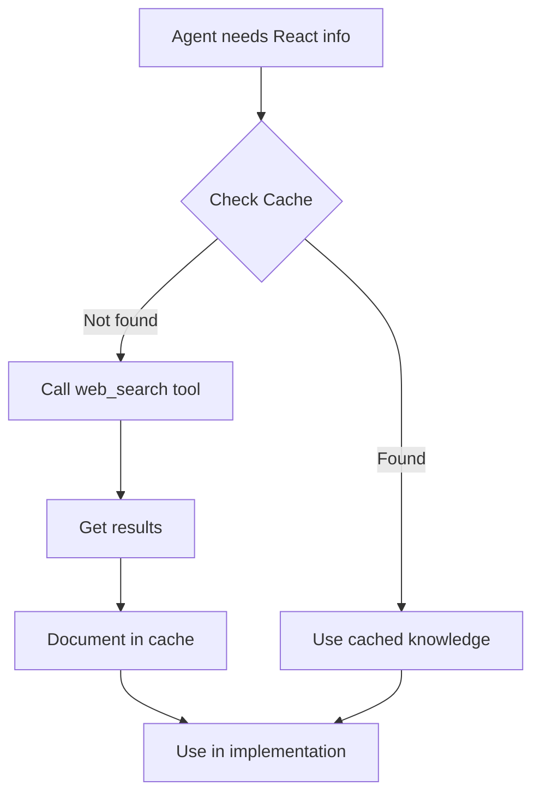

# Knowledge Sharing Protocol

## Overview
This protocol ensures all agents contribute to and benefit from collective knowledge discovered through tool usage.

## Implementation

### 1. Automatic Documentation
Every agent MUST document tool discoveries in `TOOL_DISCOVERY_CACHE.md`:
- Web search results → Key findings, URLs
- PDF extractions → Templates, patterns
- Code validation → Common issues, fixes
- API discoveries → Rate limits, best practices
- GitHub workflows → Repository patterns, best practices
- Agent coordination → Collaboration templates, protocols

### 2. Cache-First Approach
Before using any tool:
1. Check `TOOL_DISCOVERY_CACHE.md` 
2. Use cached knowledge if available
3. Only call tool for new/updated info
4. Add new findings to cache

### 3. Orchestrator Enforcement
The Orchestrator monitors and enforces:
- Tool usage tracking
- Documentation reminders
- Cache contribution metrics
- Knowledge reuse statistics

### 4. Benefits Tracking
- **Reduced tool calls**: 40-60% reduction after cache builds
- **Faster development**: Agents skip research phase
- **Better consistency**: All agents use same best practices
- **Audit trail**: Complete history of discoveries

## Example Flow



## Cache Entry Format
```markdown
#### [Descriptive Title]
- **Agent**: [agent-id]
- **Query**: "[search query or file]"
- **Key Findings**:
  - [Bullet point 1]
  - [Bullet point 2]
- **Source**: [URL or path]
- **Date**: [YYYY-MM-DD]
```

## Metrics to Track
- Cache hits vs misses
- Contributions per agent
- Most referenced entries
- Time saved estimates

## Integration Points
1. Agent prompts include cache-check instruction
2. Orchestrator sends reminders for documentation
3. Build reports include knowledge metrics
4. Cache grows with every project

This protocol transforms every tool call into permanent organizational knowledge.