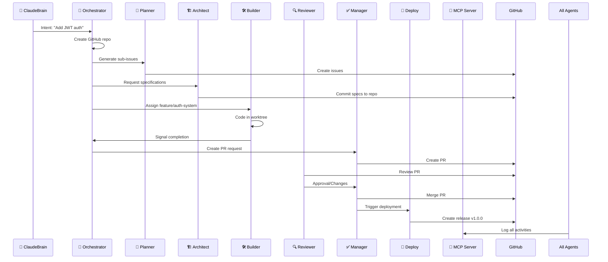
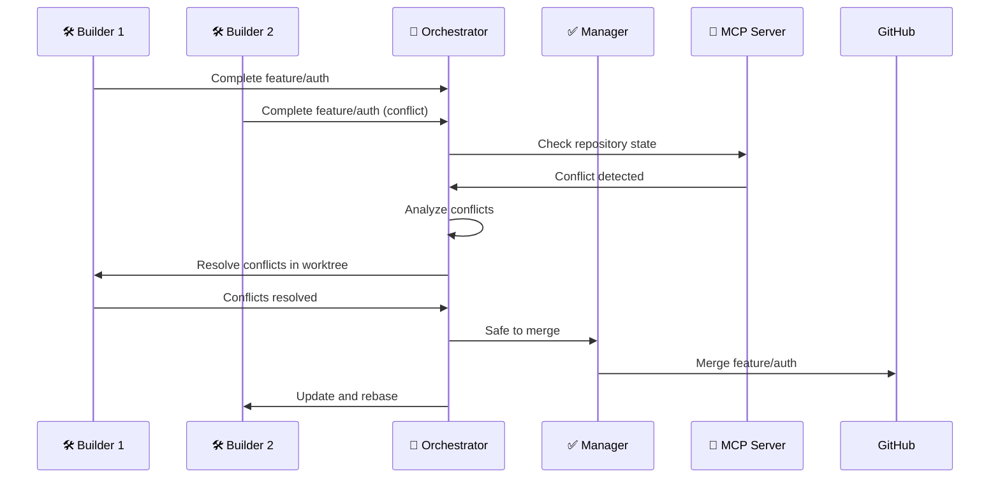

# GitHub Management & Synchronization Architecture

> Comprehensive guide to distributed GitHub repository management across ClaudeBuild v2 agents

## 🎯 Overview

In ClaudeBuild v2, GitHub management and synchronization responsibilities are distributed across multiple specialized agents, each handling specific parts of the Git lifecycle under the supervision of the **🤖 Orchestrator Agent** and **✅ Manager Agent**. This architecture ensures scalable, reliable, and conflict-free repository management for complex multi-agent development workflows.

## 🏗️ Architecture Principles

### Core Design Principles

1. **Separation of Concerns** - Each agent has specific, non-overlapping GitHub responsibilities
2. **Centralized Coordination** - Orchestrator Agent maintains overall sync integrity
3. **Atomic Operations** - All Git operations are atomic and conflict-safe
4. **Hierarchical Control** - Clear delegation chain prevents conflicts
5. **Audit Trail** - Complete traceability of all repository changes

### Agent Hierarchy

```
🧠 ClaudeBrain/Origin AI (Intent & Context)
    ↓
🤖 Orchestrator Agent (PRIMARY: Repo Management)
    ├── 📘 Planner Agent (Issues)
    ├── 🏗️ Architect Agent (Specs)
    ├── 🛠️ Builder Agents (Code)
    ├── 🔍 Review Agents (Reviews)
    ├── ✅ Manager Agent (SECONDARY: PRs & Merging)
    └── 🚀 Deploy Agent (Releases)
```

## 🔧 Detailed Agent Responsibilities

### 🧠 ClaudeBrain / Origin AI
**Role**: Initial intent logging and context setup

**GitHub Responsibilities**:
- ❌ **Not directly responsible for GitHub operations**
- ✅ Logs user prompts into system memory
- ✅ Creates initial metadata (project name, description, tags)
- ✅ May predefine GitHub repository structure (repo.json, .gitignore, LICENSE)
- ✅ Establishes project context for downstream agents

**Example Operations**:
```json
{
  "intent": "Create new React project with authentication",
  "metadata": {
    "projectName": "secure-react-app",
    "description": "React application with JWT authentication",
    "tags": ["react", "auth", "typescript"],
    "githubRepo": "user/secure-react-app"
  },
  "structure": {
    "license": "MIT",
    "gitignore": "node_modules/\n.env\ndist/",
    "readme": "# Secure React App\n\nReact application with authentication..."
  }
}
```

### 🤖 Orchestrator Agent ✅ (PRIMARY RESPONSIBLE)
**Role**: Primary GitHub repository management and synchronization

**GitHub Responsibilities**:
- ✅ **Creates the GitHub repository** (if new project)
- ✅ **Initializes Git** (`git init`) and sets up remote origin
- ✅ **Connects local project to GitHub**
- ✅ **Maintains local + GitHub sync integrity**
- ✅ **Creates the initial issue** (MAIN ISSUE) and applies labels
- ✅ **Triggers branch creation** using `git worktree` for Builder Agents
- ✅ **Pushes initial commits** and architecture templates
- ✅ **Delegates follow-up steps** to specialized agents
- ✅ **Monitors overall repository health** and resolves conflicts

**Git Workflow Commands**:
```bash
# Repository Initialization
git init
git remote add origin https://github.com/user/project.git

# Worktree Management
git worktree add .worktrees/feature/auth-system feature/auth-system
git worktree add .worktrees/feature/frontend-ui feature/frontend-ui

# Sync Operations
git fetch origin
git pull origin main
git push origin main

# Branch Management
git branch feature/auth-system
git checkout feature/auth-system
```

**Repository Structure Created**:
```
project-root/
├── .git/                      # Main repository
├── .worktrees/               # Isolated workspaces
│   ├── feature/auth-system/  # Builder Agent 1 workspace
│   ├── feature/frontend-ui/  # Builder Agent 2 workspace
│   └── feature/api-layer/    # Builder Agent 3 workspace
├── MAIN_ISSUE.md            # Primary issue definition
├── tasks.json               # Task breakdown
├── .claudebuild/            # ClaudeBuild configuration
└── README.md                # Project documentation
```

### 📘 Planner Agent
**Role**: GitHub issue management and task breakdown

**GitHub Responsibilities**:
- ✅ **Generates sub-issues** on GitHub from tasks.json
- ✅ **Adds labels, priorities, dependencies** to issues
- ✅ **Links issues to specific Builder Agent IDs**
- ✅ **Maintains issue hierarchy** and relationships
- ❌ **Does not commit or push code**

**Issue Creation Workflow**:
```javascript
// Example issue creation
const issues = [
  {
    title: "Implement JWT Authentication System",
    body: `
## Description
Create a complete JWT authentication system with login, logout, and token refresh.

## Acceptance Criteria
- [ ] JWT token generation and validation
- [ ] Login/logout endpoints
- [ ] Token refresh mechanism
- [ ] Secure password hashing

## Assigned Agent
Builder Agent 1 (ID: builder-auth-001)

## Dependencies
- Depends on: Database setup (#2)
- Blocks: Frontend auth components (#5)
    `,
    labels: ["enhancement", "auth", "backend", "high-priority"],
    assignees: ["builder-auth-001"],
    milestone: "v1.0.0"
  }
];

// GitHub API call
await githubAPI.createIssue(issues[0]);
```

**Issue Labels System**:
```yaml
Priority Labels:
  - critical
  - high-priority
  - medium-priority
  - low-priority

Type Labels:
  - enhancement
  - bug
  - feature
  - refactor
  - docs

Component Labels:
  - frontend
  - backend
  - auth
  - database
  - api

Agent Labels:
  - planner-task
  - architect-task
  - builder-task
  - review-task
  - deploy-task
```

### 🏗️ Architect Agent
**Role**: Specification documentation and architectural guidelines

**GitHub Responsibilities**:
- ✅ **Links specifications to their sub-issues**
- ✅ **Adds documents/files to the repo** (e.g., `SPEC/<task>.md`)
- ✅ **Commits structured specifications** locally
- ✅ **Coordinates with Orchestrator** for push timing
- ✅ **Maintains architectural documentation**

**Specification Structure**:
```
SPEC/
├── architecture/
│   ├── system-overview.md
│   ├── database-schema.md
│   └── api-design.md
├── features/
│   ├── auth-system.md
│   ├── user-management.md
│   └── frontend-components.md
└── guidelines/
    ├── coding-standards.md
    ├── testing-strategy.md
    └── deployment-process.md
```

**Example Specification Commit**:
```bash
# Architect Agent commits
git add SPEC/features/auth-system.md
git commit -m "📋 Add JWT authentication system specification

- Define authentication flow and endpoints
- Specify token structure and validation
- Document security requirements
- Link to issue #3

Specification: SPEC/features/auth-system.md
Issue: https://github.com/user/project/issues/3
Agent: architect-001"
```

### 🛠️ Builder Agents (Multiple Instances)
**Role**: Code implementation in isolated environments

**GitHub Responsibilities**:
- ✅ **Clones the repo** (via `git worktree`)
- ✅ **Creates feature branches** like `feature/<task-name>`
- ✅ **Works locally, commits changes** (atomic commits encouraged)
- ✅ **Signals completion** back to Orchestrator
- ❌ **Do not push or open PRs directly** (controlled by Manager)

**Isolated Workspace Setup**:
```bash
# Each Builder Agent works in isolation
cd .worktrees/feature/auth-system

# Local development workflow
git status
git add src/auth/
git commit -m "✨ Implement JWT token generation

- Add JWT service with token creation
- Implement secure token validation
- Add refresh token mechanism
- Include comprehensive error handling

Closes: #3
Agent: builder-auth-001"

# Signal completion (but don't push)
echo "TASK_COMPLETE" > .claudebuild/status
```

**Commit Message Standards**:
```
Type Emoji Conventions:
✨ :sparkles: - New feature
🐛 :bug: - Bug fix
📚 :books: - Documentation
🎨 :art: - Code structure/format
⚡ :zap: - Performance improvement
🔧 :wrench: - Configuration
🧪 :test_tube: - Tests
🔒 :lock: - Security

Format:
<emoji> <type>: <description>

- Detailed change 1
- Detailed change 2
- Detailed change 3

Closes: #<issue-number>
Agent: <agent-id>
```

### 🔍 Review Agents
**Role**: Code review and quality assurance

**GitHub Responsibilities**:
- ✅ **Review code in branches** via GitHub PR interface
- ✅ **Comment, suggest, or approve** changes
- ✅ **Use structured review commands** (`/review --hat=QA`)
- ✅ **Open GitHub discussions** if needed for complex issues
- ❌ **Do not merge** (controlled by Manager Agent)

**Review Workflow**:
```javascript
// Review Agent workflow
const reviewResult = {
  pullRequest: "#15",
  reviewer: "review-qa-001",
  status: "changes_requested",
  comments: [
    {
      file: "src/auth/jwt.js",
      line: 45,
      comment: "Consider adding input validation for token payload",
      suggestion: "if (!payload || typeof payload !== 'object') throw new Error('Invalid payload')"
    },
    {
      file: "tests/auth.test.js",
      line: 12,
      comment: "Add test case for malformed tokens"
    }
  ],
  overall: "Code quality is good, but needs additional validation and test coverage"
};

// Post review via GitHub API
await githubAPI.createReview(reviewResult);
```

**Review Types**:
```yaml
Security Review:
  - Vulnerability scanning
  - Authentication/authorization checks
  - Input validation verification
  - Secure coding practices

Quality Review:
  - Code structure and readability
  - Performance considerations
  - Error handling completeness
  - Documentation quality

Testing Review:
  - Test coverage verification
  - Test case completeness
  - Integration test validation
  - Performance test requirements
```

### ✅ Manager Agent ✅ (SECONDARY RESPONSIBLE)
**Role**: Pull request management and integration

**GitHub Responsibilities**:
- ✅ **Creates PRs** for each finished subtask
- ✅ **Triggers GitHub Actions/CI** to validate
- ✅ **Runs linter, security checks, test coverage**
- ✅ **Posts PR summary and results** back to MCP
- ✅ **Merges PRs to main** or dev upon approval
- ✅ **Cleans up branches and worktrees**

**PR Creation Workflow**:
```javascript
// Manager Agent PR creation
const pullRequest = {
  title: "✨ Implement JWT Authentication System",
  head: "feature/auth-system",
  base: "main",
  body: `
## 📋 Summary
Implements complete JWT authentication system as specified in issue #3.

## ✅ Changes Made
- JWT token generation and validation service
- Login/logout API endpoints
- Token refresh mechanism
- Secure password hashing with bcrypt
- Comprehensive error handling

## 🧪 Testing
- Unit tests: 95% coverage
- Integration tests: All passing
- Security scan: No vulnerabilities found

## 📖 Documentation
- API documentation updated
- README.md updated with auth usage
- Specification implemented: SPEC/features/auth-system.md

## 🔗 Related Issues
Closes #3: JWT Authentication System

## 👨‍💻 Agent Information
- Builder Agent: builder-auth-001
- Reviewer: review-qa-001
- Manager: manager-001

---
🤖 Generated with ClaudeBuild v2
  `,
  labels: ["ready-for-review", "auth", "backend"],
  assignees: ["manager-001"]
};

await githubAPI.createPullRequest(pullRequest);
```

**CI/CD Integration**:
```yaml
# .github/workflows/claudebuild-ci.yml
name: ClaudeBuild CI
on:
  pull_request:
    branches: [main, develop]

jobs:
  validate:
    runs-on: ubuntu-latest
    steps:
      - uses: actions/checkout@v3
      - name: Run ClaudeBuild Validation
        run: |
          npm install
          npm run lint
          npm run test:coverage
          npm run security:scan
          npm run build
      
      - name: Comment Results
        uses: actions/github-script@v6
        with:
          script: |
            const results = require('./ci-results.json');
            await github.rest.issues.createComment({
              issue_number: context.issue.number,
              owner: context.repo.owner,
              repo: context.repo.repo,
              body: `## 🤖 ClaudeBuild CI Results
              
              ✅ Linting: ${results.lint.status}
              ✅ Tests: ${results.tests.coverage}%
              ✅ Security: ${results.security.issues} issues
              ✅ Build: ${results.build.status}`
            });
```

### 🚀 Deploy Agent
**Role**: Release management and deployment

**GitHub Responsibilities**:
- ✅ **Creates release tags** (e.g., `v1.0.0`)
- ✅ **Publishes artifacts** (Docker images, release zips, etc.)
- ✅ **Updates CHANGELOG.md** and release notes in GitHub
- ✅ **Triggers GitHub Pages** or deploy pipelines (if configured)
- ✅ **Manages deployment environments**

**Release Workflow**:
```bash
# Deploy Agent release process
git tag -a v1.0.0 -m "🚀 Release v1.0.0: JWT Authentication System

Features:
- Complete JWT authentication implementation
- Secure token management
- Comprehensive test coverage
- API documentation

Agents Involved:
- Planner: planner-001
- Architect: architect-001  
- Builder: builder-auth-001
- Reviewer: review-qa-001
- Manager: manager-001
- Deploy: deploy-001"

git push origin v1.0.0

# Create GitHub release
gh release create v1.0.0 \
  --title "🚀 ClaudeBuild v1.0.0" \
  --notes-file RELEASE_NOTES.md \
  --generate-notes
```

**Deployment Artifacts**:
```
releases/v1.0.0/
├── source-code.zip
├── docker-images/
│   ├── app-v1.0.0.tar
│   └── nginx-v1.0.0.tar
├── documentation/
│   ├── api-docs.pdf
│   └── user-guide.pdf
└── checksums/
    ├── SHA256SUMS
    └── SHA256SUMS.sig
```

### 🧠 MCP Server
**Role**: Context storage and repository intelligence

**GitHub Responsibilities**:
- ✅ **Stores and indexes** all GitHub data:
  - Commits and commit history
  - PR metadata and reviews
  - Issue tracking and relationships
  - Task-to-commit mappings
  - Worktree status and health
- ✅ **Securely manages** GitHub tokens and credentials
- ✅ **Provides search capabilities** for all repository data
- ✅ **Maintains versioned repository trees** for contextual lookups
- ✅ **Generates analytics** and insights

**Data Structure**:
```json
{
  "repository": {
    "name": "secure-react-app",
    "url": "https://github.com/user/secure-react-app",
    "lastSync": "2024-01-15T10:30:00Z",
    "branches": {
      "main": { "lastCommit": "abc123", "agents": [] },
      "feature/auth-system": { "lastCommit": "def456", "agents": ["builder-auth-001"] }
    }
  },
  "commits": [
    {
      "sha": "abc123",
      "message": "✨ Implement JWT token generation",
      "author": "builder-auth-001",
      "timestamp": "2024-01-15T09:15:00Z",
      "files": ["src/auth/jwt.js", "tests/auth.test.js"],
      "issue": "#3",
      "branch": "feature/auth-system"
    }
  ],
  "pullRequests": [
    {
      "number": 15,
      "title": "✨ Implement JWT Authentication System",
      "status": "merged",
      "author": "manager-001",
      "reviewers": ["review-qa-001"],
      "mergedBy": "manager-001",
      "mergedAt": "2024-01-15T11:00:00Z"
    }
  ],
  "issues": [
    {
      "number": 3,
      "title": "Implement JWT Authentication System",
      "status": "closed",
      "assignee": "builder-auth-001",
      "labels": ["enhancement", "auth", "backend"],
      "closedBy": "manager-001"
    }
  ]
}
```

## 📊 Responsibility Matrix

| Task | Primary Agent | Secondary Agent | Supporting Agents |
|------|---------------|-----------------|-------------------|
| **Repository Initialization** | 🤖 Orchestrator | - | 🧠 ClaudeBrain |
| **Issue Creation & Management** | 📘 Planner | 🤖 Orchestrator | - |
| **Specification Documentation** | 🏗️ Architect | 🤖 Orchestrator | 📘 Planner |
| **Code Implementation** | 🛠️ Builder Agents | 🤖 Orchestrator | 🏗️ Architect |
| **Code Review** | 🔍 Review Agents | ✅ Manager | - |
| **PR Creation & Merging** | ✅ Manager | 🤖 Orchestrator | 🔍 Review Agents |
| **Release & Deployment** | 🚀 Deploy Agent | ✅ Manager | 🤖 Orchestrator |
| **Data Storage & Analytics** | 🧠 MCP Server | - | All Agents |
| **Conflict Resolution** | 🤖 Orchestrator | ✅ Manager | 🧠 MCP Server |
| **Security & Credentials** | 🧠 MCP Server | 🤖 Orchestrator | - |

## 🔄 Workflow Examples

### Complete Feature Development Flow



### Conflict Resolution Flow



## 🛡️ Security & Best Practices

### GitHub Token Management

```javascript
// Secure token storage in MCP Server
const githubCredentials = {
  tokens: {
    orchestrator: process.env.GITHUB_TOKEN_ORCHESTRATOR,
    manager: process.env.GITHUB_TOKEN_MANAGER,
    deploy: process.env.GITHUB_TOKEN_DEPLOY
  },
  permissions: {
    orchestrator: ["repo", "issues", "admin:repo_hook"],
    manager: ["repo", "pull_requests"],
    deploy: ["repo", "packages:write"]
  }
};

// Token rotation policy
setInterval(async () => {
  await rotateGitHubTokens();
}, 30 * 24 * 60 * 60 * 1000); // 30 days
```

### Branch Protection Rules

```yaml
# GitHub branch protection settings
protection_rules:
  main:
    required_status_checks:
      - claudebuild-ci
      - security-scan
    enforce_admins: true
    required_pull_request_reviews:
      required_approving_review_count: 1
      dismiss_stale_reviews: true
    restrictions:
      users: ["manager-001", "orchestrator-001"]
    
  develop:
    required_status_checks:
      - claudebuild-ci
    required_pull_request_reviews:
      required_approving_review_count: 1
```

### Audit Trail

```json
{
  "auditLog": [
    {
      "timestamp": "2024-01-15T10:30:00Z",
      "agent": "orchestrator-001",
      "action": "repository.create",
      "target": "user/secure-react-app",
      "details": {
        "visibility": "private",
        "template": "claudebuild-template"
      }
    },
    {
      "timestamp": "2024-01-15T10:35:00Z",
      "agent": "planner-001",
      "action": "issue.create",
      "target": "user/secure-react-app#3",
      "details": {
        "title": "Implement JWT Authentication System",
        "assignee": "builder-auth-001"
      }
    }
  ]
}
```

## 🚨 Error Handling & Recovery

### Common Scenarios

1. **Merge Conflicts**
   ```bash
   # Orchestrator handles conflicts
   git fetch origin
   git rebase origin/main
   # Auto-resolve or delegate to Builder Agent
   ```

2. **Failed Deployments**
   ```javascript
   // Deploy Agent rollback
   if (deploymentFailed) {
     await rollbackToLastKnownGood();
     await notifyTeam("Deployment failed, rolled back to v0.9.5");
   }
   ```

3. **Corrupted Worktrees**
   ```bash
   # Orchestrator cleanup and recreation
   git worktree remove .worktrees/feature/broken-branch
   git worktree add .worktrees/feature/auth-system-fixed feature/auth-system
   ```

### Monitoring & Alerts

```javascript
// Repository health monitoring
const healthChecks = {
  syncStatus: () => checkGitHubSync(),
  branchHealth: () => validateAllBranches(),
  worktreeIntegrity: () => checkWorktrees(),
  ciStatus: () => validateCIPipeline()
};

// Alert on issues
setInterval(async () => {
  const health = await runHealthChecks();
  if (health.critical.length > 0) {
    await alertOrchestratorAgent(health);
  }
}, 5 * 60 * 1000); // Every 5 minutes
```

## 📈 Analytics & Insights

### Repository Metrics

```javascript
// MCP Server analytics
const analytics = {
  productivity: {
    commitsPerDay: calculateCommitsPerDay(),
    averagePRTime: calculateAveragePRTime(),
    codeQuality: assessCodeQuality()
  },
  collaboration: {
    agentEfficiency: measureAgentEfficiency(),
    reviewTurnover: calculateReviewTurnover(),
    conflictRate: measureConflictRate()
  },
  quality: {
    testCoverage: getTestCoverage(),
    bugRate: calculateBugRate(),
    securityScore: getSecurityScore()
  }
};
```

## 🎯 Implementation Guidelines

### Agent Development

1. **Follow the responsibility matrix** - Stay within assigned GitHub roles
2. **Use atomic operations** - All Git operations should be atomic and reversible
3. **Implement proper error handling** - Handle all GitHub API failures gracefully
4. **Log all activities** - Send detailed logs to MCP Server
5. **Respect rate limits** - Implement proper GitHub API rate limiting

### Configuration

```yaml
# claudebuild.yml - GitHub configuration
github:
  organization: "your-org"
  repository_prefix: "claudebuild-"
  default_branch: "main"
  
  agents:
    orchestrator:
      permissions: ["repo", "admin:repo_hook"]
      rate_limit: 5000/hour
    
    manager:
      permissions: ["repo", "pull_requests"]
      rate_limit: 2000/hour
    
    deploy:
      permissions: ["repo", "packages:write"]
      rate_limit: 1000/hour

  workflows:
    enable_ci: true
    require_reviews: true
    auto_merge: false
    deployment_approval: true
```

This comprehensive GitHub management architecture ensures that ClaudeBuild v2 can handle complex, multi-agent development workflows while maintaining repository integrity, security, and traceability.